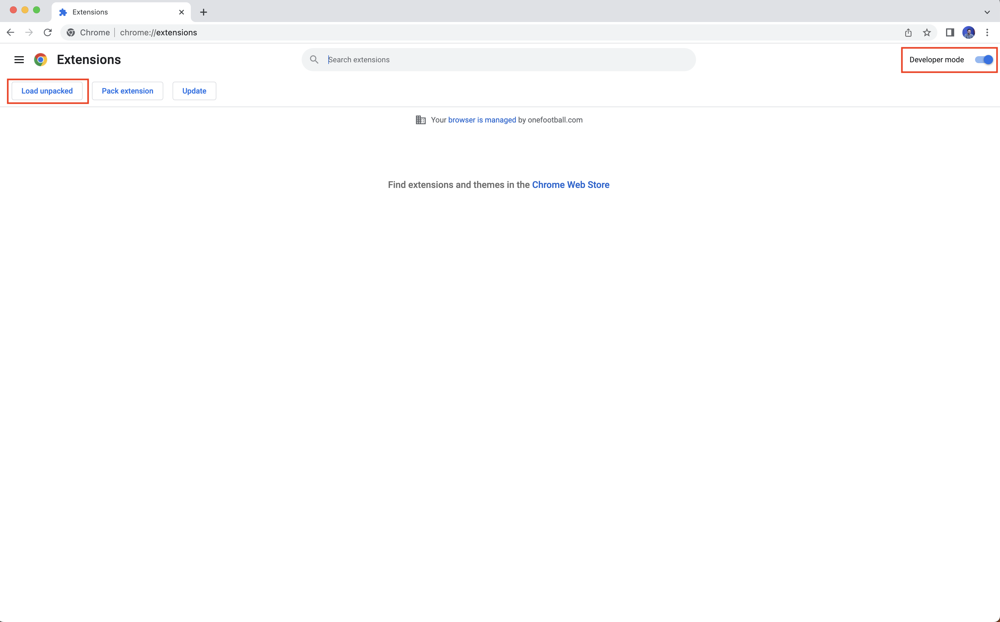
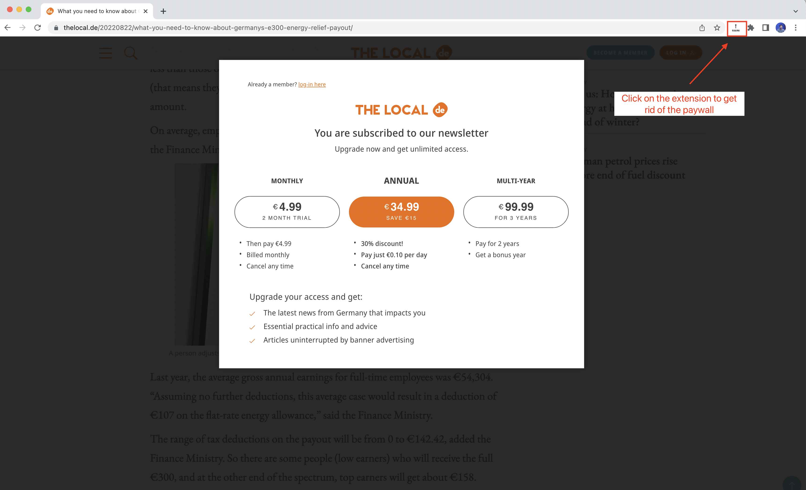

  

*Web browser extension to bypass [The Local](https://thelocal.de) paywall.*
____

## Installation instructions
1. [Download the project](https://github.com/jmcalves275/the-local-bypass-paywall/archive/refs/heads/master.zip) as a ZIP file.
2. Unzip the file in your local machine. You should have a folder named `the-local-bypass-paywall-master`.
3. Open your Chrome browser, type `chrome://extensions` in the search bar end hit Enter ↵
4. Enable the `Developer Mode` and click on `Load unpacked` to load the extension from your local machine.

5. Search for the `the-local-bypass-paywall-master` and load it.

## How to use the extension
1. Open [The Local](https://thelocal.de) page.
2. Click on a article and read it.
3. If the paywall pops up, click on The Local extension at the top-right corner.
   

Below you can find a video of how to use the extension.

___

## Next steps
- [ ] Remove paywall automatically without user interaction.

## Contributing
Feel like to contributing? Please feel free to [create a new PR](https://github.com/jmcalves275/the-local-bypass-paywall/pulls).

Have questions? Please feel free to open a [new issue](https://github.com/jmcalves275/the-local-bypass-paywall/issues).

Like the project? Star it :star: 

____

_Made with :heart: by [@jmcralves](https://twitter.com/jmcralves)_